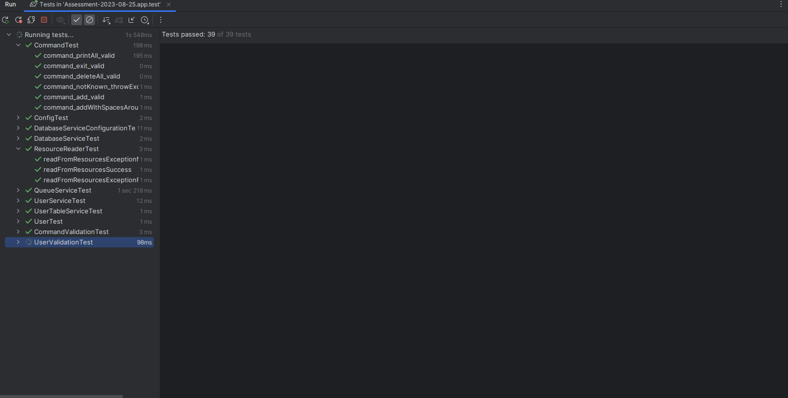
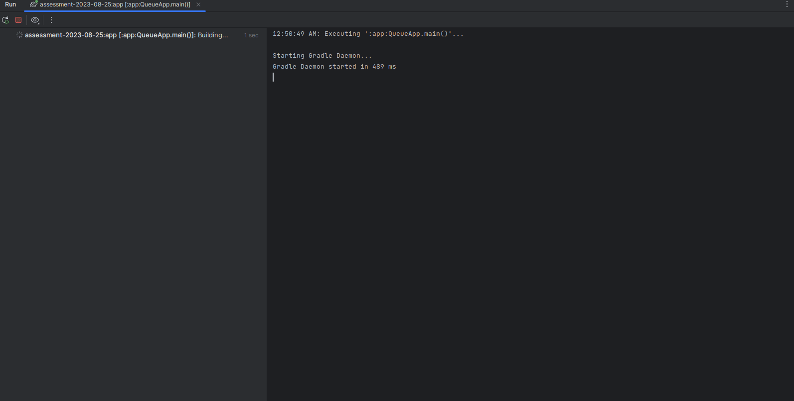

# Java Developer Assessment Exercise

## overview

Create program in Java language that will process commands from FIFO queue using
Producer – Consumer pattern.

## commands

Supported commands are the following:

`Add`  - adds a user into a databaseService

`PrintAll` – prints all users into standard output

`DeleteAll` – deletes all users from databaseService

## databaseService

User is defined as databaseService table `SUSERS` with
columns `(USER_ID, USER_GUID, USER_NAME)`

## test requirements

Demonstrate program on the following sequence (using main method or test):

1) Add (1, "a1", "Robert")

2) Add (2, "a2", "Martin")

3) PrintAll

4) DeleteAll

5) PrintAll

## unit tests required

Show your ability to unit test code on at least one class.

## code quality requirements

Goal of this exercise is to show Java language and JDK know-how, OOP principles,
clean code understanding, concurrent programming knowledge, unit testing
experience.

## limitations

Please do not use Spring framework in this exercise. Embedded databaseService is
sufficient.

# Realization

## Queue

[Queue service](app/src/main/java/assessment20230825/queue/QueueService.java) is
implemented as singleton with BlockingQueue for
consuming [Command](app/src/main/java/assessment20230825/command/Command.java)
objects.

[Consumers](app/src/main/java/assessment20230825/queue/QueueConsumer.java)
and [Producers](app/src/main/java/assessment20230825/queue/QueueProducer.java)
are running in thread pools for
graceful shutdown implementation.

Thread sleep implemented in command consumer for demonstration purpose.

## Database

[Database service](app/src/main/java/assessment20230825/database/DatabaseService.java)
is implemented as singleton with H2 in memory database.

## Commands

Available commands are defined
in [CommandsActionEnum](app/src/main/java/assessment20230825/command/CommandsActionEnum.java).

## Unit tests

## Required test case run in main method

